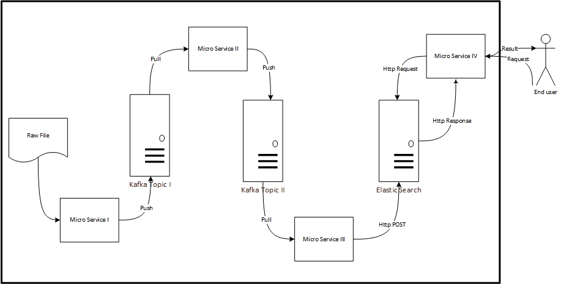

# Colaberry-Scala-Capstone Project 
High level architecture of the Micro-service based system
Key tech used: Akka, Kafka, Scala, ElasticSearch

## Architecture

## Project - Phase 1: first micro service 
### Read raw data from local csv file and integreate into Kafka

## Project - Phase 2: second micro service 
### Consume Kafka stream on a configured topic, make the simple process, and add to a new topic 

## Project - Phase 3: third micro service
### Consume enhanced data from Kafka and ingest into Elastic Search 

## Project - Phase 4: fourth micro service 
### Offer API to search for data stored in Elastic Search 

